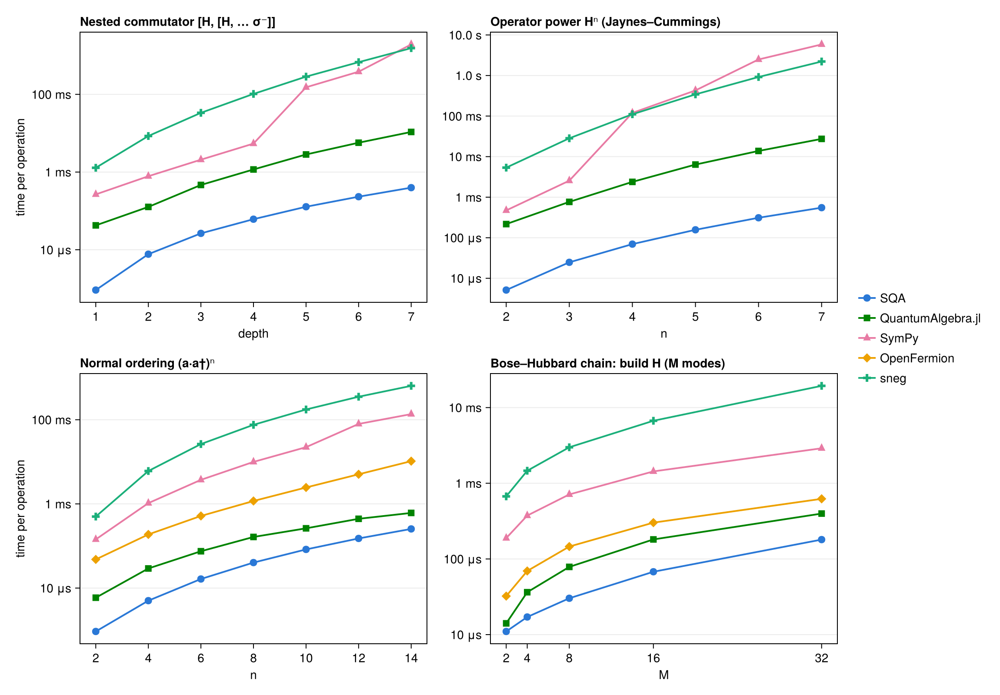

# Comparison with other packages

Several packages, across several languages, do symbolic second-quantized operator algebra. This page benchmarks SecondQuantizedAlgebra (SQA) head-to-head against four of them on a compact suite of practical tasks: building Hamiltonians, deriving Heisenberg equations of motion, nested commutators, operator powers, normal ordering, multi-mode chains, symbolic indexed sums, and mean-field expectation values.

| Package | Language | Canonicalization | Bosons | Two-level / spin | Symbolic coefficients | Indexed sums (symbolic N) | Symbolic ⟨·⟩ |
|---|---|---|---|---|---|---|---|
| SecondQuantizedAlgebra.jl | Julia | eager | ✓ | ✓ (N-level, Pauli, spin-S) | ✓ | ✓ | ✓ |
| [QuantumAlgebra.jl](https://github.com/jfeist/QuantumAlgebra.jl) | Julia | lazy (`normal_form`) | ✓ | ✓ (spin-½) | ✓ | ✓ | ✓ |
| [SymPy](https://docs.sympy.org/latest/modules/physics/quantum/index.html) (`sympy.physics.quantum`) | Python | lazy (`normal_ordered_form`) | ✓ | ✓ (Pauli) | ✓ | ✗ | ✗ |
| [OpenFermion](https://quantumai.google/openfermion) (`BosonOperator`) | Python | lazy (`normal_ordered`) | ✓ | ✗ (separate qubit type) | ✗ (numeric only) | ✗ | ✗ |
| [sneg](http://auger.ijs.si/sneg/) | Mathematica | eager (`nc`) | ✓ | ✓ (fermionic mode) | ✓ | ✗ | ✗ |

The suite definition, canonical benchmark keys, and the runner scripts live in the repository under `benchmark/comparison/`; see [Reproducing](@ref) below.

## Methodology

!!! note "Fairness contract"
    The packages have different evaluation strategies, so a naive comparison is misleading. Every row times each package **producing the same canonical (normal-ordered) result from the same physical input**, written idiomatically in that package.

    * **Eager packages** (SQA, sneg) canonicalize on every multiplication, so the operation itself is timed.
    * **Lazy packages** (QuantumAlgebra, SymPy, OpenFermion) keep products symbolic until a normalization call, so the arithmetic is timed *together with* the normalization that reaches the canonical form the eager packages hand you for free.
    * **Products of three or more factors** use the eager workflow on the lazy side too: normalize after each multiply rather than expanding the whole product first. Timing a lazy package on the fully expanded product would penalize a workflow choice, not an algorithm (see the ergonomics note below).

    Before timing, every script checks textbook identities in its own package (``a a† = 1 + a†a``, ``a a a† = a†a a + 2a``, two-level completeness ``σ⁻σ⁺ + σ⁺σ⁻ = 1``). A failing check aborts that package's run. Any benchmark whose single trial evaluation exceeds 3 s is reported as *capped* instead of timed.

Further caveats, each disclosed rather than silently absorbed:

* **Cross-language ratios are order-of-magnitude indicators.** Every harness gives each scenario the same wall-clock budget (up to ~10 s) in a single process and reports the minimum per-call time (Julia via BenchmarkTools, Python via pyperf, Mathematica via a calibrated timing loop); fast scenarios stop early once ~50 samples are collected, and only scenarios slower than a few hundred ms per call use the full budget. Harness overhead and warm-up behavior still differ across runtimes, so read `90×` as "roughly two orders of magnitude", not as a precise figure. The Julia-vs-Julia column *is* precise.
* **OpenFermion uses numeric coefficients** (ω = 1.0, J = 0.5, U = 0.25) because `BosonOperator` does not accept symbols. That is *less* work than the symbolic-coefficient arithmetic every other package performs, so OpenFermion's numbers are, if anything, flattered. It also cannot mix bosons with qubit operators in one expression, so the Jaynes–Cummings rows are not expressible.
* **SymPy needs a small disclosed helper.** `normal_ordered_form` does not know that boson and Pauli operators act on different Hilbert spaces (and hence commute), so mixed products fail to merge out of the box. The benchmark script includes a ~15-line helper that sorts boson factors before Pauli factors in each product; its cost is included in SymPy's timed path.
* **sneg encodes the two-level atom as a single fermionic mode.** For one site the fermion algebra (``f f† + f†f = 1``, ``f² = 0``) is isomorphic to the σ algebra and bosons commute with fermions, so all Jaynes–Cummings results are identical to a spin encoding; this is also sneg's idiomatic usage in quantum impurity physics.
* **Different canonical bases.** QuantumAlgebra expands ``σ⁺σ⁻`` into ``σˣ/σʸ/σᶻ`` form and SymPy works in its Pauli basis, whereas SQA keeps the transition form. Results are physically equivalent but not term-by-term identical.

## Results

Single Linux workstation, 2026-07-21: SQA 0.10.0 and QuantumAlgebra 1.6.0 on Julia 1.12.6, SymPy 1.14.0 and OpenFermion 1.8.1 on Python 3.14.6, sneg 2.0.21 on Mathematica 14.2. The SQA column is absolute time; every other cell shows that package's time with its ratio to SQA in parentheses, so `(9.1×)` means 9.1× slower than SQA. `n/a` means the scenario is not expressible in that package.

| Benchmark | SQA | QuantumAlgebra.jl | SymPy | OpenFermion | sneg |
|---|---:|---:|---:|---:|---:|
| Jaynes–Cummings: build H | 1.500 μs | 19.040 μs (13×) | 73.943 μs (49×) | n/a | 186.711 μs (120×) |
| Jaynes–Cummings: H² | 5.140 μs | 220.801 μs (43×) | 463.839 μs (90×) | n/a | 5.251 ms (1000×) |
| Heisenberg equation: [H, a] | 1.710 μs | 20.900 μs (12×) | 266.917 μs (160×) | n/a | 1.605 ms (940×) |
| Nested [H, [H, … σ⁻]] depth 2 | 7.700 μs | 126.820 μs (16×) | 781.343 μs (100×) | n/a | 8.472 ms (1100×) |
| Nested [H, [H, … σ⁻]] depth 4 | 61.240 μs | 1.166 ms (19×) | 5.402 ms (88×) | n/a | 102.622 ms (1700×) |
| Nested [H, [H, … σ⁻]] depth 6 | 232.321 μs | 5.690 ms (24×) | 382.454 ms (1600×) | n/a | 672.748 ms (2900×) |
| Normal-order (a·a†)⁴ | 5.020 μs | 29.221 μs (5.8×) | 1.044 ms (210×) | 188.194 μs (37×) | 6.054 ms (1200×) |
| Normal-order (a·a†)⁸ | 40.350 μs | 163.951 μs (4.1×) | 9.967 ms (250×) | 1.174 ms (29×) | 75.820 ms (1900×) |
| Bose–Hubbard (M = 8): build H | 30.240 μs | 78.550 μs (2.6×) | 712.174 μs (24×) | 145.807 μs (4.8×) | 2.990 ms (99×) |
| Bose–Hubbard (M = 8): H² | 436.901 μs | 1.428 ms (3.3×) | 3.229 s (7400×) | 3.609 ms (8.3×) | 2.472 s (5700×) |
| Tavis–Cummings Σᵢ: build H | 1.400 μs | 11.070 μs (7.9×) | n/a | n/a | n/a |
| Tavis–Cummings: [H, σ⁺ⱼσ⁻ⱼ] | 30.000 μs | 354.721 μs (12×) | n/a | n/a | n/a |
| Mean-field ⟨H⟩ | 39.241 μs | 1.360 μs (0.035×) | n/a | n/a | n/a |



### Reading the results

* **SQA leads every operator-algebra row, against every package.** The closest competitor throughout is QuantumAlgebra, which shares SQA's Julia substrate and a specialized bosonic normal-ordering engine. The general-purpose CAS approaches (SymPy, Mathematica-based sneg) sit well behind on the same physics.
* **The lead widens exactly where real derivations spend their time.** Nested commutators (the core of Heisenberg / Schrieffer–Wolff / cumulant derivations) are where the gap grows fastest with depth, as the top-left panel shows. Eager canonicalization keeps every intermediate compact, so the cost compounds more slowly.
* **Operator powers separate width from depth.** The top-right panel sweeps ``Hⁿ`` (an eager fold, same contract as the table): a single wide product-and-collect rather than a deep recursion, and the place where general-CAS normal ordering degrades fastest while SQA and QuantumAlgebra stay near log-linear. It is the product-expansion counterpart of the nested-commutator panel and stresses like-term collection instead of cancellation.
* **Chain length probes system size, not expression size.** The bottom-right panel builds the Bose–Hubbard Hamiltonian on M = 2, 4, 8, 16, 32 modes; unlike the other three sweeps it grows the number of Hilbert-space factors rather than the depth or width of a single expression. The Hamiltonian has ``O(M)`` terms, so every package scales near-linearly and the panel becomes a constant-factor race where the field bunches closest together. Building a Hamiltonian is the one axis with the least canonicalization work per term.
* **OpenFermion is the strongest non-Julia contender on pure bosonic work,** while computing with plain numeric coefficients, a strictly easier task than the symbolic arithmetic every other column performs.
* **The one row SQA loses is measuring different objects.** QuantumAlgebra's `expval` tags operators inside its own term type (a near-trivial field move), whereas SQA's `average` materializes a Symbolics.jl `Num` expression (splitting coefficients into real and imaginary parts and building a CAS term tree). That object is what feeds `substitute`, `simplify`, numeric conversion, and ModelingToolkit downstream, so the extra cost buys the bridge into the Julia symbolics ecosystem.
* **Symbolic indexed sums are a two-package race.** Only SQA and QuantumAlgebra can express ``Σᵢ gᵢ(a†σ⁻ᵢ + aσ⁺ᵢ)`` with a *symbolic* atom number N, and the ``[H, σ⁺ⱼσ⁻ⱼ]`` diagonal split is the operation that turns such sums into mesoscopic equations of motion.

### Ergonomics: eager by default vs the lazy-product footgun

The contract above uses the *eager* workflow for lazy packages. Their *default* lazy workflow has a sharp footgun on powers, building the full product before canonicalizing: with QuantumAlgebra, `normal_form(H⁴)` for the Jaynes–Cummings H costs about 86 ms and 2.2 M allocations lazily versus 2.3 ms and 84 k allocations eagerly, a roughly 37× time difference from one workflow choice. SymPy's Bose–Hubbard H² row above is the same effect in a different package. SQA canonicalizes on every `*`, so this cliff does not exist for its users.

## [Reproducing](@id Reproducing)

Each language has a runner script in `benchmark/comparison/` that validates the known-answer identities, runs its scenarios, and writes one `results/<package>.json` per package (the Julia script covers both SQA and QuantumAlgebra in one run); `make_table.jl` merges whatever JSONs exist into the table and figure above. The scenario definitions and canonical keys live in `benchmark/comparison/BENCHMARKS.md`.

```sh
# Julia (SQA + QuantumAlgebra)
julia --project=benchmark benchmark/comparison/julia_bench.jl

# Python (each needs: pip install sympy openfermion pyperf)
python benchmark/comparison/sympy_bench.py
python benchmark/comparison/openfermion_bench.py

# Mathematica (needs sneg installed)
wolframscript -f benchmark/comparison/sneg_bench.wls

# Merge into the docs table + figure
julia --project=benchmark benchmark/comparison/make_table.jl
```
