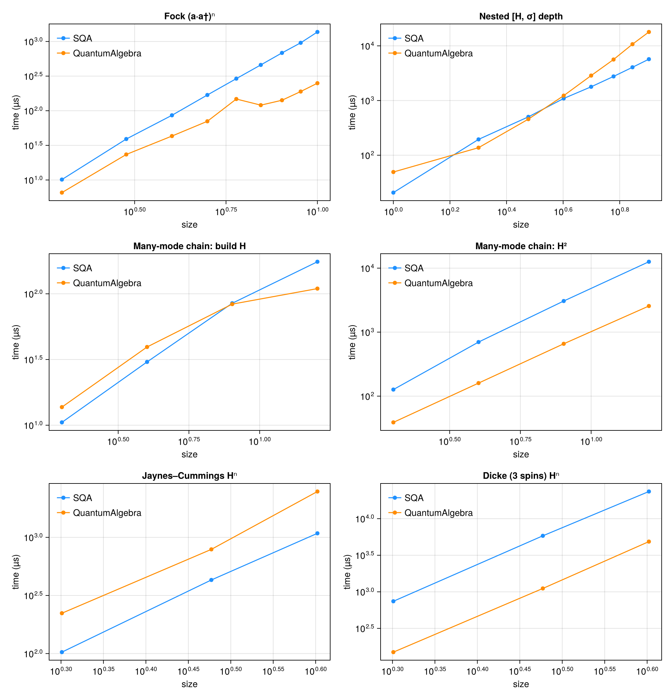

# Comparison with QuantumAlgebra.jl

[QuantumAlgebra.jl](https://github.com/jfeist/QuantumAlgebra.jl) is the other mature Julia package for symbolic second-quantized operator algebra. It and SecondQuantizedAlgebra (SQA) overlap on bosonic ladder operators, two-level systems, indexed sums, and expectation values, so a direct performance comparison is meaningful, as long as it is done fairly. This page documents a fair benchmark and the methodology behind it.

The benchmark script is `benchmark/quantumalgebra_comparison.jl`; re-run it with `julia --project=benchmark benchmark/quantumalgebra_comparison.jl`.

## Methodology

!!! note "Fairness contract"
    The two packages have different evaluation strategies, so a naive comparison is misleading. Every row below times each package **producing the same canonical result from the same physical input**, written idiomatically in each package.

    * **SQA canonicalizes eagerly.** Every `*` and `+` already returns the normal-ordered, fully-simplified expression. The work happens at construction time, so for SQA we time the construction/arithmetic itself.
    * **QuantumAlgebra canonicalizes on demand.** Products stay symbolic until `normal_form` is called, so for QA we time the arithmetic together with the normalization that reaches the canonical form SQA hands you for free. In every case this is QA's *eager* workflow, expressed differently per operation class: `normal_form` once for a single operation or single product (`build H`, `H²`, where a lone multiply has no eager versus lazy distinction), `normal_form ∘ comm` after each level of a nested commutator, and `normal_form` after each `*` for a multi-factor power (`Hⁿ`, `(a·a†)ⁿ`). The eager versus lazy gap only opens for chains of three or more factors, which is why it matters for the powers; see the warning below.

    This charges each package for the total work needed to reach a usable, canonical expression.

!!! warning "Eager vs lazy matters for products, and the fair choice is eager"
    For a product of many factors (`H²`, `Hⁿ`, `(a·a†)ⁿ`) QA has two workflows that reach the same answer but cost wildly different amounts:

    * **Lazy** (`normal_form(H^n)`): build the entire un-normal-ordered product, then canonicalize once. The intermediate expression explodes before it collapses.
    * **Eager** (`auto_normal_form(true)`, or `normal_form` after each `*`): canonicalize at every multiply, so intermediates never blow up. This is *exactly* what SQA does on every `*`.

    Comparing SQA's eager `*` against QA's **lazy** product would penalise QA for a workflow choice rather than an algorithmic difference: `JC H⁴` is `107.6 ms` (2.2M allocations) lazily but `3.16 ms` (84k) eagerly. The head-to-head therefore uses QA's **eager** workflow for all products and powers, the genuine apples-to-apples comparison. (The lazy blowup is a real *ergonomics* difference, since SQA is eager by default so users never hit it, but that is a usability point rather than a raw-speed claim, and is reported separately.)

Further caveats:

* **Validated against known answers.** Before timing, the script checks a set of textbook operator identities (e.g. ``a a† = 1 + a†a``, ``a a a† = a†a a + 2a``, two-level completeness ``σgg + σee = 1``) *independently in each package*. This confirms both sides compute the correct canonical result, the premise of a fair comparison, rather than asserting their internal representations are byte-identical (they are not; see the next point).
* **Different canonical basis.** QA expands the two-level excited projector ``σ⁺σ⁻`` into ``σˣ/σʸ/σᶻ`` form, whereas SQA keeps the ``σ``-transition form. Results are physically equivalent but not term-by-term identical, which can shift term counts on either side.
* **Only mutually-expressible operations are compared.** See [SQA-only capabilities](@ref) for physics QuantumAlgebra cannot express, which is excluded from the timing table rather than presented as a rigged win.
* **Large cases are time-capped.** The scaling sweeps register each benchmark only if a single trial evaluation stays under a few seconds, so a runaway term-blowup on either side degrades gracefully instead of stalling the suite.

## Results

Measured with `BenchmarkTools` (median of each side), Julia 1.12, SecondQuantizedAlgebra v0.8.0, QuantumAlgebra v1.6.0, on a single Linux workstation (2026-06-23). QA uses its eager workflow for products and powers, as described in the fairness contract above. `QA / SQA` is the QuantumAlgebra time divided by the SecondQuantizedAlgebra time, so `12.0×` means QA took 12× as long and `0.5×` means QA was faster. Absolute numbers are machine-dependent; the ratios and *scaling trends* are the point.

| Benchmark | SQA | QuantumAlgebra | QA / SQA | SQA allocs | QA allocs |
|----|----:|----:|----:|----:|----:|
| **Core algebra** | | | | | |
| Jaynes–Cummings: build H | 3.2 μs | 38.6 μs | 12.0× | 104 | 921 |
| Jaynes–Cummings: H² | 7.2 μs | 291.5 μs | 40.4× | 204 | 8831 |
| Schrieffer–Wolff: [S, V] | 16.1 μs | 118.8 μs | 7.4× | 242 | 2958 |
| Schrieffer–Wolff: [S, [S, H₀]] | 36.9 μs | 351.9 μs | 9.5× | 525 | 10474 |
| Two cavities: build H | 6.5 μs | 18.5 μs | 2.9× | 115 | 373 |
| Two cavities: H² | 12.3 μs | 55.8 μs | 4.5× | 224 | 1184 |
| Multi-mode 6-op chain | 4.4 μs | 21.5 μs | 4.9× | 76 | 443 |
| **Indexed sums** | | | | | |
| Tavis–Cummings Σ construction | 2.8 μs | 21.9 μs | 7.9× | 88 | 679 |
| Dicke Σ construction | 9.6 μs | 19.3 μs | 2.0× | 191 | 479 |
| Dicke diagonal-collapse [H, σ_j] | 42.5 μs | 76.0 μs | 1.8× | 746 | 1226 |
| Double Σ_ij spin–spin | 8.8 μs | 5.3 μs | 0.6× | 147 | 197 |
| **Expectation values** | | | | | |
| ⟨a† σ⁻⟩ | 5.4 μs | 2.7 μs | 0.5× | 75 | 121 |
| ⟨H_JC⟩ | 51.5 μs | 1.9 μs | 0.0× | 547 | 81 |

### Reading the results

The perf work in SQA v0.6 through v0.8 (native numeric and parameter-polynomial coefficients, cached term hashing, and a single collapsed concrete operator type) reshaped the picture: SQA now leads across essentially the whole operator-algebra suite, including cases that previously favoured QuantumAlgebra.

* **SQA leads on building and transforming Hamiltonians, by wide margins.** Assembling coupled light–matter Hamiltonians, squaring them, and running Schrieffer–Wolff transformations is far faster (JC build 12.0×, JC H² 40.4×, SW 7.4–9.5×, Tavis–Cummings construction 7.9×), with an order-of-magnitude allocation gap. SQA's eager pipeline reuses its dict-based term storage instead of re-deriving normal order per call.
* **The cases that used to favour QuantumAlgebra have flipped.** Squaring multi-mode bosonic Hamiltonians and the two-cavity / 6-op chains were QA wins (0.3–0.5×) at v0.5.1; with native coefficient arithmetic they are now SQA wins (two cavities H² 4.5×, multi-mode 6-op chain 4.9×).
* **The only remaining QuantumAlgebra edges are narrow.** The double-`Σ` spin–spin *construction* (0.6×) is a small-constant-overhead case, and the expectation-value rows are a representation difference rather than an algorithmic one (see below).
* **Expectation values measure different objects.** QA's `expval` formally tags operators inside its own native term type (a near-trivial field move), whereas SQA's `average` materializes a Symbolics.jl `Num` expression (splitting each coefficient into real and imaginary parts and building a CAS term tree). The two return different object types, so treat these rows as "constructing an expectation-value object" of different kinds rather than a like-for-like speed comparison. The SQA object is what feeds `substitute`, `simplify`, numeric conversion, and ModelingToolkit.

### Scaling and large systems

Point measurements at small sizes are dominated by constant overhead. The more honest comparison is how each package *scales*. (QA uses its eager workflow throughout, per the fairness contract.)



| Benchmark | SQA | QuantumAlgebra | QA / SQA | SQA allocs | QA allocs |
|----|----:|----:|----:|----:|----:|
| **Fock (a·a†)ⁿ** | | | | | |
| n=2 | 1.4 μs | 8.3 μs | 6.1× | 21 | 262 |
| n=4 | 9.2 μs | 56.2 μs | 6.1× | 73 | 1110 |
| n=6 | 36.0 μs | 134.6 μs | 3.7× | 173 | 2642 |
| n=8 | 89.9 μs | 258.2 μs | 2.9× | 337 | 5050 |
| n=10 | 187.8 μs | 392.8 μs | 2.1× | 584 | 8508 |
| **Nested [H, σ] depth** | | | | | |
| depth=1 | 8.5 μs | 62.9 μs | 7.4× | 150 | 1785 |
| depth=3 | 140.2 μs | 641.0 μs | 4.6× | 1965 | 17197 |
| depth=5 | 262.0 μs | 3.81 ms | 14.5× | 6637 | 94849 |
| depth=7 | 1.16 ms | 15.53 ms | 13.4× | 15712 | 335052 |
| depth=8 | 1.08 ms | 24.33 ms | 22.4× | 22425 | 548664 |
| **Many-mode chain: H²** | | | | | |
| M=2 | 12.1 μs | 52.3 μs | 4.3× | 224 | 1312 |
| M=4 | 78.6 μs | 217.7 μs | 2.8× | 1222 | 6254 |
| M=8 | 266.1 μs | 840.5 μs | 3.2× | 5481 | 25200 |
| M=16 | 1.19 ms | 3.66 ms | 3.1× | 23067 | 99372 |
| **Jaynes–Cummings Hⁿ** | | | | | |
| n=2 | 7.5 μs | 343.1 μs | 45.9× | 206 | 8832 |
| n=3 | 48.6 μs | 1.06 ms | 21.8× | 798 | 28850 |
| n=4 | 138.9 μs | 3.55 ms | 25.6× | 1983 | 83970 |
| **Dicke (3 spins) Hⁿ** | | | | | |
| n=2 | 72.7 μs | 185.8 μs | 2.6× | 1258 | 5570 |
| n=3 | 552.8 μs | 1.48 ms | 2.7× | 8185 | 39556 |
| n=4 | 2.32 ms | 7.70 ms | 3.3× | 29342 | 158742 |

What the scaling reveals:

* **Commutator nesting is SQA's clearest win, and it widens with depth.** `[H, [H, … σ]]` starts at 7.4× and climbs to **22.4× at depth 8**, with an order-of-magnitude allocation gap (22k vs 549k). QA's lazy intermediate growth compounds at every level, while SQA's eager pipeline keeps each intermediate canonical and compact.
* **Powers of the Jaynes–Cummings Hamiltonian are a large SQA win** (22–46× across `n = 2…4`), the mixed boson + two-level case where SQA's term storage pays off heavily even against QA's eager workflow.
* **The bosonic powers have flipped to SQA.** `(a·a†)ⁿ`, many-mode `H²`, and the 3-spin Dicke `Hⁿ` were ~5× QA wins at v0.5.1 and are now SQA wins (2–6×). QuantumAlgebra's specialized bosonic normal-ordering still scales gracefully, so on pure Fock powers the lead narrows as `n` grows (6.1× at `n=2` down to 2.1× at `n=10`), but SQA stays ahead across the swept range.

The headline: **after the v0.6–v0.8 coefficient and hashing work, SQA leads across nearly the entire suite, and its biggest leads are exactly the operations that dominate deriving equations of motion (building Hamiltonians, powers, and nested commutators), with the commutator lead growing with problem size.** QuantumAlgebra remains close on pure bosonic powers and retains a small edge on micro-scale construction and on the expectation-value object. Both reach identical physics; pick by which operations dominate your workload.

### Ergonomics: eager-by-default vs the lazy-product footgun

The fairness contract uses QA's *eager* product workflow. Its *default* lazy workflow has a sharp footgun on high powers, building the full product before canonicalizing:

| `JC H⁴` | time | allocations |
|----|----:|----:|
| QA lazy (`normal_form(H^4)`) | 107.6 ms | 2,199,379 |
| QA eager (`normal_form` per `*`) | 3.16 ms | 83,970 |

A 34× time and 26× memory difference from one workflow choice. SQA canonicalizes eagerly on every `*`, so this cliff simply does not exist for its users, a usability advantage distinct from the raw-speed numbers above.

The `auto_normal_form(true)` toggle makes QA eager globally; on the JC build it gives SQA **3.24 µs** vs QA-eager **39.5 µs**, confirming the build-time gap is intrinsic to the normal-ordering cost rather than the eager/lazy choice.

## [SQA-only capabilities](@id SQA-only capabilities)

QuantumAlgebra's two-level support is **Pauli / spin-½ only**. It has no general ``N``-level transition operators, no arbitrary spin-``S`` operators, and no numeric conversion. The following SQA features therefore have no QuantumAlgebra counterpart and are excluded from the timing table above rather than shown as one-sided wins.

**General ``N``-level transitions**, e.g. a three-level Λ-system:

```julia
h = FockSpace(:c) ⊗ NLevelSpace(:Λ, 3, 1)
a = Destroy(h, :a, 1)
σ(i, j) = Transition(h, :σ, i, j, 2)
H = Δ_p * σ(2, 2) + (Δ_p - Δ_c) * σ(3, 3) +
    Ω_p * (a' * σ(1, 2) + a * σ(2, 1)) + Ω_c * (σ(2, 3) + σ(3, 2))
```

**Arbitrary spin-``S`` operators** (QA only has spin-½):

```julia
h = SpinSpace(:s)
Sx = Spin(h, :S, 1)   # full spin algebra, not just Pauli
Sz = Spin(h, :S, 3)
```

**Numeric conversion to QuantumOpticsBase**, turning a symbolic average into a number on a concrete Hilbert space:

```julia
numeric_average(average(a' * s), ψ; level_map = levelmap)
```

These reflect SQA's design goal: a single algebra spanning Fock, ``N``-level, Pauli, spin, and phase-space operators, with a bridge to numerics, at a small constant per-operation overhead relative to a boson-specialized library.
