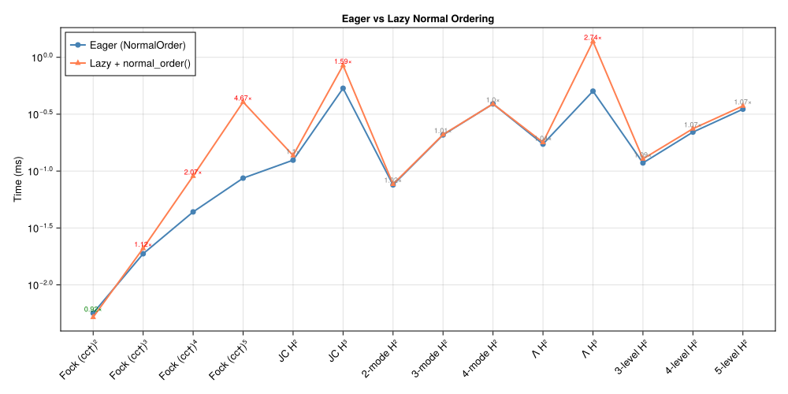

```@meta
CurrentModule = SecondQuantizedAlgebra
```

# Ordering Conventions

SecondQuantizedAlgebra.jl supports two operator ordering conventions that control when commutation relations are applied: **eager** (at multiplication time) and **lazy** (deferred to an explicit call). This page explains the trade-offs and shows why eager ordering is the default.

## Eager ordering (`NormalOrder`)

With [`NormalOrder`](@ref) (the default), every `*` call immediately applies commutation relations and returns a fully canonical [`QAdd`](@ref):

```@example ordering
using SecondQuantizedAlgebra # hide
h = FockSpace(:cavity)
@qnumbers a::Destroy(h)
a * a'   # [a, a†] = 1 applied immediately → a†a + 1
```

This means expressions are always in canonical form — no intermediate un-ordered products exist. Subsequent operations (addition, further multiplication) work on already-simplified terms, so like terms are collected early and the expression stays compact.

### What "canonical" means under `NormalOrder`

Three transformations fire eagerly during `*`, each producing a different aspect of the canonical form:

1. **Commutation swaps** — Fock ``[a, a^\dagger] = 1``, Spin ``[S_j, S_k] = i\epsilon_{jkl}S_l``, PhaseSpace ``[p, x] = -i``. Creation operators end up to the left of annihilation operators.
2. **Algebraic reductions** — Transition composition ``|i\rangle\langle j|\cdot|k\rangle\langle l| = \delta_{jk}|i\rangle\langle l|`` and the Pauli product rule ``\sigma_j \sigma_k = \delta_{jk} I + i\epsilon_{jkl}\sigma_l``.
3. **Completeness for `NLevelSpace` ground-state projectors** — when a same-site composition would produce ``|g\rangle\langle g|`` (the ground-state projector of an [`NLevelSpace`](@ref)), it is rewritten via the completeness relation
   ```math
   |g\rangle\langle g| = 1 - \sum_{k \neq g}|k\rangle\langle k|
   ```
   so that ``|g\rangle\langle g|`` never appears in canonical-form dict keys.

The third point is what makes the basis ``\{\sigma^{ij} : (i,j) \neq (g,g)\} \cup \{1\}`` *linearly independent* — without it, ``\sum_j \sigma^{jj} = 1`` introduces an algebraic redundancy and physically equal expressions can have different dict keys (and so compare unequal under `isequal`). Each [`Transition`](@ref) carries `ground_state` and `n_levels` directly, so the eager arithmetic does this without consulting the Hilbert space.

```@example ordering
ha = NLevelSpace(:atom, 2)              # ground state = 1
σ12 = Transition(ha, :σ, 1, 2)
σ21 = Transition(ha, :σ, 2, 1)
σ12 * σ21    # composes to σ¹¹, then expanded: 1 - σ²²
```

## Lazy ordering (`LazyOrder`)

With [`LazyOrder`](@ref), multiplication concatenates operators without applying *any* of the three eager transformations:

```@example ordering
set_ordering!(LazyOrder())
expr = a * a'   # stored as a·a† — no reordering
```

The user controls each transformation explicitly:

| Want | Call |
|---|---|
| Reductions only (Pauli, Transition composition) — keep ``\sigma^{gg}`` atomic | [`simplify`](@ref)`(expr)` |
| Reductions + commutation swaps — full normal ordering | [`normal_order`](@ref)`(expr)` |
| Either of the above + completeness — full canonical form | [`simplify`](@ref)`(expr, h)` or [`normal_order`](@ref)`(expr, h)` |

The Hilbert-space argument is the LazyOrder opt-in for completeness; under `NormalOrder` it is a no-op since the eager arithmetic already produced canonical form.

```@example ordering
set_ordering!(NormalOrder())  # hide
normal_order(expr)   # now applies [a, a†] = 1 → a†a + 1
```

```@example ordering
set_ordering!(NormalOrder())  # restore default
nothing # hide
```

## Why eager ordering is the default

In a lazy scheme, intermediate expressions can grow large because like terms are not collected until normal ordering is applied at the end. Consider computing ``H^3`` for a Jaynes–Cummings Hamiltonian: each multiplication doubles or triples the number of terms, and without eager simplification the intermediate ``H^2`` carries many redundant terms that cancel only after final ordering.

With eager ordering, commutation rules fire at each multiplication step. This collects like terms early, keeping intermediate results compact. The result: **eager ordering is consistently faster** for typical quantum optics workflows.

### Benchmark results

The plot below compares eager vs lazy ordering across a range of systems, from simple Fock powers ``(a a^\dagger)^n`` to multi-mode hopping Hamiltonians and lambda systems. Each benchmark measures the total time to construct and order the expression.



Key observations:
- **Eager is faster in all cases**, typically by 1.5–5×.
- The advantage grows with expression complexity: more terms means more opportunity for early cancellation.
- For simple cases (e.g. single Fock mode), the difference is small since there are few terms to collect.

The benchmark can be reproduced with:
```
julia --project=benchmark benchmark/eager_vs_lazy.jl
```

### When to use `LazyOrder`

Despite the performance advantage of eager ordering, [`LazyOrder`](@ref) can be useful when:
- You want to inspect **un-ordered operator products** before applying commutation rules.
- You want to keep ground-state projectors ``|g\rangle\langle g|`` atomic for clarity (NormalOrder eagerly expands them).
- You are building expressions where the ordering convention should be chosen later.
- You need to apply [`simplify`](@ref) (algebraic identities only) without commutation swaps.

Switch between conventions at any time:
```julia
set_ordering!(LazyOrder())      # disable eager ordering and completeness
set_ordering!(NormalOrder())    # restore canonical-form arithmetic (default)
```
